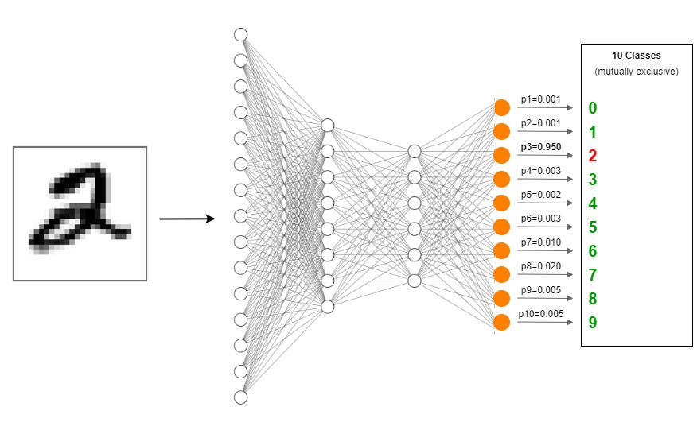

# BEST_DevOps_project

# Description
In this code we solved the classification problem of detecting what number is written in a picture using keras tensorflow package in python. We use as input a MNIST black and white picture of a digit and output the detected number which is between 0 and 9.

We are using a multi layer perceptron, with RELU and sigmoid as actiovation functions.

To prevent overfitting we decided to implement EarlyStopping.

Image by Rukshan Pramoditha

# Dataset
MNIST library

# GitHub Actions

# Metrics
Accuracy: 90%

# Authors
- Arina
- Carlos
- Maros
- Krisz
